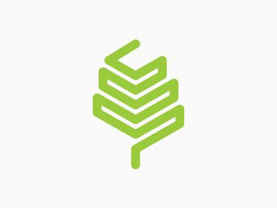

# WEBSITE REACREATION VERTICAL FARM USING HTML & CSS

### AIM :
      To Create Website -vertical Farms using HTML & CSS.

### ALGORITHM:
	
      Step 1: Start by creating a new folder. 
      Step 2: Create and Open the “index.html”, write the code.
      Step 3: Create a new CSS file “style.css” 
      Step 4: Design the basic structure of your website using HTML tags like <header>,      
                            <nav>, <main>, and <footer>.
      Step 5: Implement navigation menus using HTML lists (<ul> or <ol>) and CSS                                                   
                 styling.
      Step 6: Test your website by opening the HTML file in a web browser. Make any  
                            necessary adjustments to the HTML and CSS code to achieve the desired   
                            layout and design.

### PROGRAM :
      
     indea.html
          <!DOCTYPE html>
          <html lang="en">
            <head>
              <meta charset="UTF-8" />
              <meta http-equiv="X-UA-Compatible" content="IE=edge" />
              <meta name="viewport" content="width=device-width, initial-scale=1.0" />
              <link rel="stylesheet" href="assets/css/style.css" />
              <title>Vertical Farm</title>
            </head>
            <header class="header">
              

                
                <h1>Vertical Farm</h1>
              

              <nav class="navbar">
                <a href="#">Solutions</a>
                <a href="#">Department</a>
                <a href="#">Farming Method</a>
                <a href="#">Company</a>
                <a href="#">About</a>
                <button class="free-trail-btn">Start Free Trail</button>
                <button class="account-btn">Account</button>
              </nav>
            </header>
            <body>
              

                
Fresh Sustinable.

                
Plant Grow Vertically

                

                  in <strong><highlight>Urban Areas</highlight></strong>
                

                

                  Our vertical farming setup brings sustainable, locally grown produce to
                  urban areas. With our innovative technology we're revolutionizing the
                  way we grow and consume fresh food.
                

                <button class="start-now">Start-now</button>
                <button class="how-it-works">HOW IT WORKS</button>
              

              
                
                
              <table class="table">
                <tr class="Row-one">
                  <th>Choose the right crops</th>
                  <th>Set up your grow system</th>
                  <th>Monitor your crops</th>
                </tr>
              </table>
              <footer>
                <button class="Farm">
                  Farm Start At 7 AM
                </button>
                We offer Consulting Services For Vertical Farming Method
                
                <ul>
                  <button class="DontWait">Don't wait</button>
                  <button class="JoinUs">Join us</button>
                  <button class="ActNow">Act now</button>
                </ul>
                <ul>
                  <button class="ContactTeam">Contact Team</button>
                </ul>
              </footer>
            </body>
          </html>

      style.css
        * {
            background-color: rgb(17, 18, 19);
            color: white;
            font-family: "Segoe UI", Tahoma, Geneva, Verdana, sans-serif;
          }
          .site-header {
            border-bottom: 1px solid #ccc;
            padding: 0.5em 1em;
          }

          .site-identity img {
            max-width: 55px;
            float: left;
            margin: 0 10px 0 0;
          }
          .navbar {
            display: flex;
            align-items: right;
            float: right;
          }

          .navbar a {
            margin: 40px;
            font-size: 15px;
            font-weight: 700;
            text-decoration: none;
            position: relative;
            top: -85px;
          }
          .free-trail-btn {
            width: 110px;
            height: 40px;
            top: -55px;
            border-radius: 50px;
            font-family: inherit;
            background-color: #000000;
            color: #f8ffcf;
            border: solid 1px #f1ffa2;
            position: relative;
            font-size: 15px;
            font-weight: 300px;
            font-family: inherit;
            right: 30px;
          }
          .account-btn {
            margin: 10px;
            width: 95px;
            height: 40px;
            top: -65px;
            border-radius: 30em;
            font-size: 13px;
            font-weight: 600;
            font-family: inherit;
            background-color: #e6fd65;
            color: black;
            border: none;
            position: relative;
            right: 30px;
            z-index: 1;
          }
          /* body  
          body {
            margin: 6%;
            margin-top: -2%;
            height: 75%;
          }*/
          .text-container {
            color: white;
            height: 300px;
            width: 900px;
            padding-top: 20px;
            text-align: center;

            font-family: sans-serif;
            overflow-x: hidden;
            overflow-y: scroll;
          }

          p {
            position: relative;
            font-size: 20px;
            text-align: left;
            left: 100px;
          }
          table {
            border: #000000;
          }
          .start-now {
            width: 9em;
            height: 3em;
            border-radius: 30em;
            font-size: 13px;
            font-weight: 600;
            font-family: inherit;
            background-color: #f0ff98;
            color: black;
            border: none;
            position: relative;
            overflow: hidden;
          }
          .how-it-works {
            margin: 10px;
            width: 14%;
            height: 3em;
            border-radius: 30em;
            font-size: 13px;
            font-weight: 200;
            font-family: inherit;
            background-color: #000000;
            color: #e1f2c1;
            border: solid 1px #e1f2c1;
            position: relative;
            overflow: hidden;
          }
          /* footer  */
          footer {
            height: 140px;
            width: 100%;
            display: flex;
            align-items: center;
            justify-content: space-between;
            color: black;
            background-color: white;
          }
          .Farm {
            width: 13em;
            height: 4em;
            font-size: 12px;
            font-weight: 300;
            letter-spacing: -0.1px;
            background-color: #000000;
            color: white;
            border: solid 1px black;
            position: relative;
            left: 75px;
            left: 25px;
          }
          .Seven {
            padding: 6px 6px;
            border-radius: 90px;
            font-size: 10px;
            background-color: wheat;
            color: rgb(0, 0, 0);
            font-weight: 600;
            position: relative;
            left: 3px;
            left: 5px;
          }
          .FooterL {
            position: relative;
            left: 60px;
            left: 5px;
            height: 48px;
            width: 48px;
          }
          .footer ul li {
            list-style: none;
            display: inline-block;
            color: white;
            padding: 10px 10px;
            background-color: white;
          }
          .footer-paragraph {
            width: 22%;
            margin-left: 50px;
            font-size: 18px;
            color: black;
            background-color: white;
            font-weight: 600;
          }
          footer button {
            width: 110px;
            height: 40px;
            border-radius: 50px;
            font-size: 11px;
            font-weight: 600;
            font-family: inherit;
            background-color: #f1ffa2;
            color: black;
            border: solid 1px black;
          }
          .DontWait {
            position: relative;
            z-index: 2;
          }          
  
### OUTPUT :

### RESULT :

      Thus, to  recreate Website -vertical Farms using HTML & CSS has been implemented successfully.
